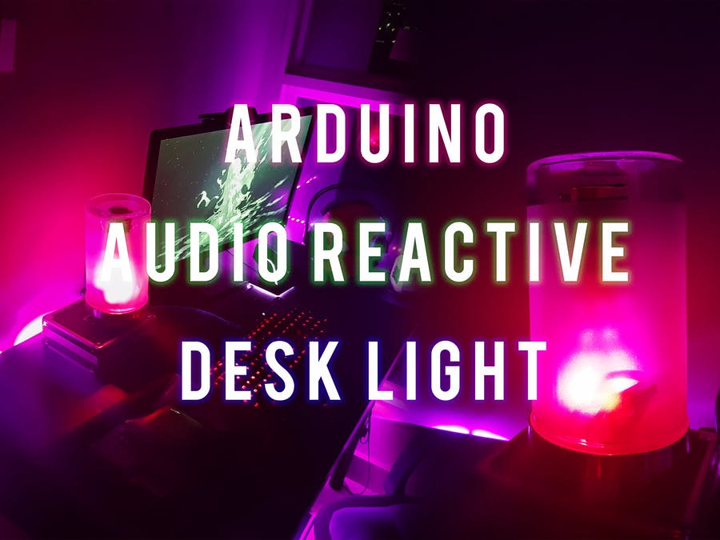
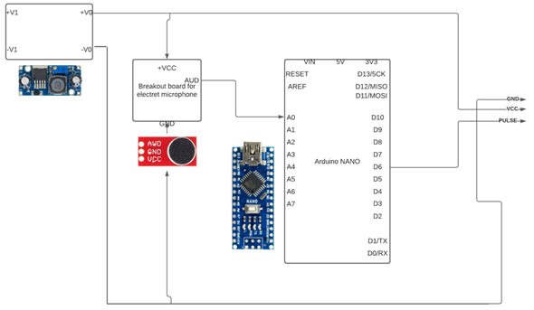
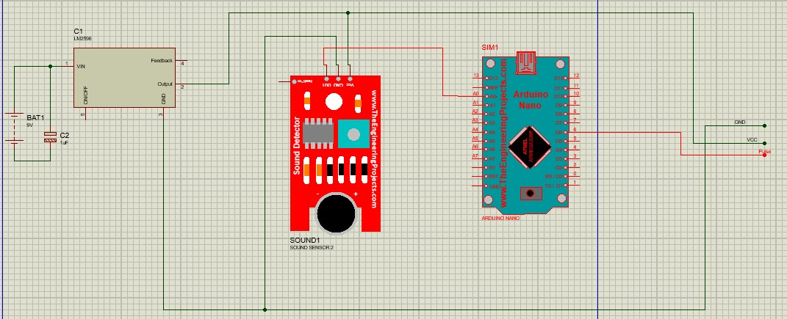

# Audio-reactive

Dispositivo capaz de transformar las ondas sonodas a colores de luces LED a través de un Arduino Nano.

## Materiales
| Descripción | Cantidad | Precio por unidad |
| --- | ---: | ---: |
| Arduino Nano R3 | 1 | $10.00 |
| Modulo de sonido  | 1 | $20.00 |
| Protoboard | 1 | $3.00 |
| Baterias 9V | 1 | $3.00 |
| Jumpers | 20 | $1.00 |
| LEDS RGB | 1 | $5.00 |
| Regulador de voltaje | 1 | $3.00 |

## Descripción
El funcionamiento de este proyecto parte de la línea de alimentación que se suministra mediante un cable USB de la PC hacia la placa de Arduino NANO, pero si se llegase a conectar una fuente externa que superen los 5V.
Se dispondrá del modulo de detector de sonido, lo cual, esto proporcionará una señal analógica al Arduino, que podemos usar para encender inteligentemente las luces RGB. 

## Diagrama
-------------------------

## Instalación e implementación
Teniendo en cuenta las conexciones ya realizadas según el diagrama, se procede a subir el código ubicado en la carpeta `script_arduino_audio_reactive`.
- Instalar las librerias necesarias para la compilación correcta en este caso: `FastLED`.
- Se debe subir le código a un arduino de tipo Arduino Nano R3.
- Una vez el codigo ya compliado y subo al Arduino, se conecta a la fuente de energia.

